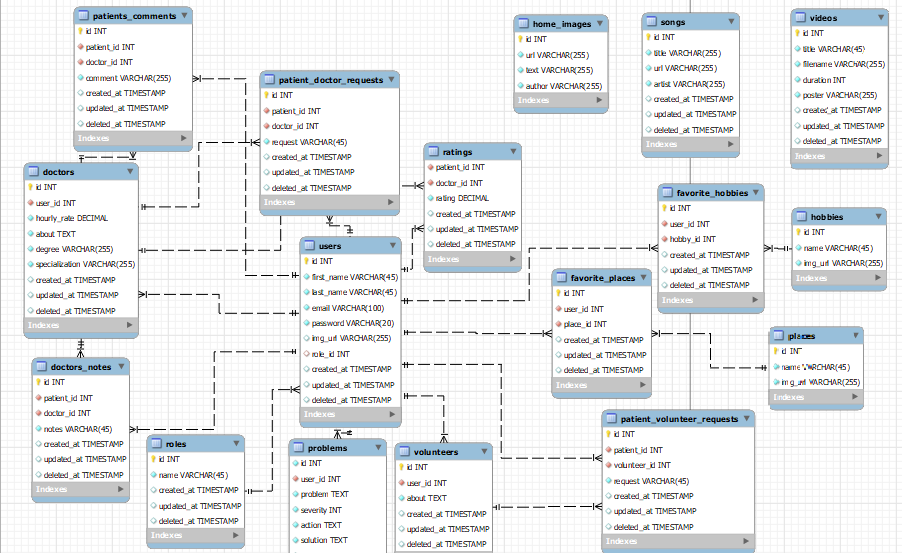

<!-- project philosophy -->


> A mobile app that guides you in your mental health journey.
>
> Peace Pulce, your dedicated mental health companion. Our app seamlessly connects you with a psychiatrist, considering your preferences and therapeutic needs. Engage in transformative video sessions. Receive daily resources tailored to your mental health journey, while also benefiting from a compassionate community of like-minded individuals. Trained volunteers are available to offer empathetic support during challenging moments. Track your progress with personalized dashboards and collaborate with your psychiatrist to set and achieve goals.

### User Stories
- As a user, I want a space where I can talk about my problems, provide quick access to calming resources when I feel overwhelmed, offer guided relaxation exercises and breathing techniques to help me manage and reduce stress levels.
- As a therapist, I want the app to have secure communication channels for virtual sessions with my clients, ensuring confidentiality and convenience.
- As a volunteer, I aim to share my self-development journey with those in need, providing them the resources and mindsets I encoporate in my daily life.

<br><br>

<!-- Tech stack -->


###  Peace Pulce is built using the following technologies:

- This project uses the [React native](https://reactnative.dev/) app development framework. React native is a cross-platform hybrid app development platform which allows us to use a single codebase for apps on mobile, desktop, and the web.
- For persistent storage (database), the app uses the [MySQL](https://www.mysql.com/) package which allows the app to create a custom storage schema and save it to a local database.
- The backend uses the [Laravel framework](https://laravel.com/). Laravel is a robust PHP framework that enables developpers to create web or mobile applications. It offers features and tools optimized for building dynamic applications.
- For voice calls, the app uses [WebRTC](https://webrtc.org/). A librairy for real time communication capabilities that work on top of an open standard. Voice is send between peers.
- The project integrates [OpenAi](https://openai.com/). It provides a versatile set of tools for natural language processing to provide assistance to our users with their problems.

<br><br>

<!-- UI UX -->


> We designed Peace Pulce using wireframes, iterating on the design until we reached the ideal layout for easy navigation and a seamless user experience.

- Project Figma design [figma](https://www.figma.com/file/ohMmlF2OchoN5mLzdtwn1v/Untitled?type=design&node-id=1-2&mode=design&t=867fxmYwHvuWmld0-0)

<br><br>

<!-- Database Design -->


###  Architecting Data Excellence: Innovative Database Design Strategies:

- Insert ER Diagram here


<br><br>


<!-- Implementation -->


### User Screens (Mobile)
| Login screen  | Register screen | Landing screen | Loading screen |
| ---| ---| ---| ---|
|  |  |  |  |
| Home screen  | Menu Screen | Order Screen | Checkout Screen |
|  |  |  |  |

### Admin Screens (Web)
| Login screen  | Register screen |  Landing screen |
| ---| ---| ---|
|  |  |  |
| Home screen  | Menu Screen | Order Screen |
|  |  |  |

<br><br>


<!-- Prompt Engineering -->


###  Mastering AI Interaction: Unveiling the Power of Prompt Engineering:

- This project uses advanced prompt engineering techniques to optimize the interaction with natural language processing models. By skillfully crafting input instructions, we tailor the behavior of the models to achieve precise and efficient language understanding and generation for various tasks and preferences.

<br><br>

<!-- AWS Deployment -->


###  Efficient AI Deployment: Unleashing the Potential with AWS Integration:

- This project leverages AWS deployment strategies to seamlessly integrate and deploy natural language processing models. With a focus on scalability, reliability, and performance, we ensure that AI applications powered by these models deliver robust and responsive solutions for diverse use cases.

<br><br>

<!-- Unit Testing -->


###  Precision in Development: Harnessing the Power of Unit Testing:

- This project employs rigorous unit testing methodologies to ensure the reliability and accuracy of code components. By systematically evaluating individual units of the software, we guarantee a robust foundation, identifying and addressing potential issues early in the development process.

<br><br>


<!-- How to run -->


> To set up Coffee Express locally, follow these steps:

### Prerequisites

This is an example of how to list things you need to use the software and how to install them.
* npm
  ```sh
  npm install npm@latest -g
  ```

### Installation

_Below is an example of how you can instruct your audience on installing and setting up your app. This template doesn't rely on any external dependencies or services._

1. Get a free API Key at [example](https://example.com)
2. Clone the repo
   git clone [github](https://github.com/your_username_/Project-Name.git)
3. Install NPM packages
   ```sh
   npm install
   ```
4. Enter your API in `config.js`
   ```js
   const API_KEY = 'ENTER YOUR API';
   ```

Now, you should be able to run Coffee Express locally and explore its features.